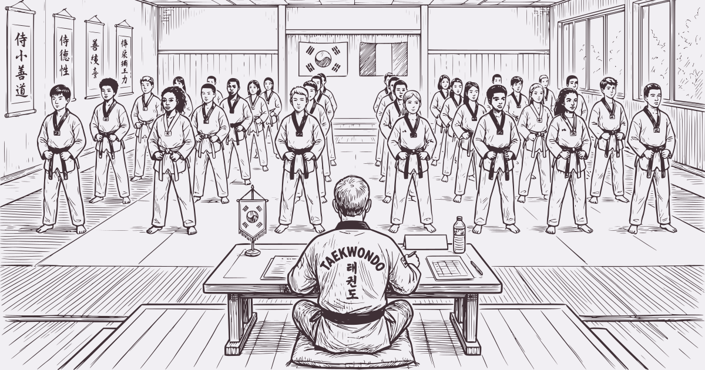

# 심사 Simsa

> Application PWA de notation pour passages de grades de taekwondo  
> 태권도 승급심사 채점 애플리케이션

🌐 **https://simsa.moudok.fr/**


---

## Présentation

**Simsa** (심사, *examen* en coréen) est une application web progressive (PWA) permettant la gestion complète des passages de grades de taekwondo. L'application fonctionne **100% hors ligne**, sur mobile, tablette et laptop. Aucune information n'est jamais envoyée sur Internet (aucune connexion à Internet n'est requise) et il n'est pas nécessaire de créer un compte.

Les noms des élèves sont saisis soit directement sur le téléphone du Maître, soit depuis un ou plusieurs téléphones d'élèves. Les informations sont transmises au Maître par QR code. Il est possible de définir manuellement des binômes ; sinon, le système les forme automatiquement au mieux (même grade, même genre, triés par âge).

Le Maître peut modifier les épreuves, en ajouter ou en supprimer. Si un jury composé de plusieurs membres est présent, ceux-ci peuvent scanner l'ensemble des informations (liste des élèves et des épreuves) sur leurs propres téléphones.

L'application permet de noter les performances des élèves en leur attribuant des bons points ou des mauvais points (un clic pour incrémenter, double clic pour décrémenter). En glissant vers la droite, le Maître ou le jury passe à l'épreuve suivante. Un compte à rebours paramétrable est disponible dans la barre en bas (pratique pour les combats par exemple).

À l'issue des épreuves, la page de résultats permet de visualiser un récapitulatif global et de décider du résultat de chaque élève. Les membres du jury peuvent exporter leurs résultats vers le téléphone du Maître. Un export PDF permet de visualiser le résultat final.



---

## Rôles

| Rôle | Description |
|---|---|
| **Élève** | Saisit ses informations et génère son QR d'inscription |
| **Maître** | Crée la session, scanne les inscriptions, note les élèves, consulte les résultats, exporte et efface |

---

## Fonctionnalités

- 🌐 **Bilingue** — Interface en français et en 한국어 (coréen), extensible à d'autres langues
- 📴 **100% offline** — Aucune connexion internet requise, toutes les pages sont pré-téléchargées à l'installation
- 📱 **Multi-support** — Mobile iOS/Android, tablette, laptop
- 🔒 **RGPD** — Données stockées uniquement en local, suppression immédiate en fin de session
- 📷 **QR codes** — Échanges de données sans réseau (séquencés automatiquement si > 3KB)
- ⏱ **Chronomètres** — Heure, durée session, compte à rebours avec bip
- 📊 **Résultats** — Tableau interactif avec verdicts (reçu/refusé), détail par jury, export PDF
- 📤 **Échange de données** — YAML ou QR codes (épreuves, élèves), export/import des résultats du jury avec vérification d'intégrité
- 🔢 **Versioning** — Numéro de version inclus dans tous les échanges, détection d'incompatibilité

---

## Stack technique

| Couche | Technologie |
|---|---|
| Framework UI | [Ionic](https://ionicframework.com/) |
| Framework JS | [Vue 3](https://vuejs.org/) + TypeScript |
| Build | [Vite](https://vitejs.dev/) + [vite-plugin-pwa](https://vite-pwa-org.netlify.app/) |
| State | [Pinia](https://pinia.vuejs.org/) |
| i18n | [vue-i18n](https://vue-i18n.intlify.dev/) |
| Stockage | IndexedDB via [idb](https://github.com/jakearchibald/idb) |
| QR génération | [qrcode](https://github.com/soldair/node-qrcode) |
| QR scan | [html5-qrcode](https://github.com/mebjas/html5-qrcode) |
| Export YAML | [js-yaml](https://github.com/nodeca/js-yaml) |
| Export PDF | [jsPDF](https://github.com/parallax/jsPDF) + [jspdf-autotable](https://github.com/simonbengtsson/jsPDF-AutoTable) |
| Compression | [lz-string](https://github.com/pieroxy/lz-string) |
| Police | Noto Sans KR (support Hangul, bundlée offline) |

---

## Installation

```bash
# Cloner le dépôt
git clone https://github.com/moudok/simsa.git
cd simsa

# Installer les dépendances
npm install

# Lancer en développement
npm run dev

# Build production
npm run build

# Prévisualiser le build
npm run preview
```

---

## Grades supportés

`blanc → jaune → jaune+ → vert → vert+ → bleu → bleu+ → rouge → rouge+ → rouge++ → noir`

---

## Épreuves par défaut

| Français | 한국어 |
|---|---|
| Théorie | 이론 |
| Kibon | 기본 |
| Poomsé | 품새 |
| Ho Shin Sool | 호신술 |
| Han Bon Kyorugi | 한번겨루기 |
| Casse | 격파 |
| Kyorugi (combat) | 겨루기 |

Les épreuves sont modifiables par le Maître dans un tableau compact (mode tableur), avec réorganisation par glisser-déposer. Les durées de compte à rebours sont configurables séparément.

---

## Versioning

Chaque échange de données (QR code ou export YAML) inclut le numéro de version de l'application (`simsa_version`). En cas d'incompatibilité de format entre versions :

- **Version majeure différente** → erreur bloquante avec message explicite
- **Version mineure différente** → avertissement non bloquant
- **Champ version absent** → erreur bloquante (format non reconnu)

---

## Utilisation

### 1. Configuration (Maître)

Le Maître configure une fois pour toutes :
- Les langues disponibles
- La liste des épreuves, leurs libellés dans chaque langue et leurs durées de compte à rebours

Ces données sont **persistantes** et survivent à la suppression des données de session.

### 2. L'élève s'inscrit

Sur son téléphone, l'élève ouvre l'app en mode **Élève**, saisit :
- Prénom, nom, grade, année de naissance, genre
- Binôme souhaité (facultatif)

L'app génère un **QR code d'inscription** que le Maître scanne.

### 3. Le Maître prépare la session

Le Maître ouvre l'app en mode **Maître** et :
- Crée la session (nom, date)
- Scanne les QR codes des élèves (triés automatiquement)
- Partage la config aux membres du jury via QR

### 4. La notation

Le Maître note avec de grands boutons tactiles **＋** et **－** pour chaque élève × épreuve. Chaque carte affiche le genre (♂/♀) et l'année de naissance. Les binômes manuels sont reliés par un trait. Les filtres permettent d'afficher certains grades ou genres.

La barre permanente affiche en tout temps l'heure, la durée de session et le compte à rebours.

### 5. Échange de données

Depuis la page **Échange de données** :
- **Tout exporter / importer** (YAML ou QR) — épreuves, paramètres et élèves
- **Exporter les résultats** (QR) — le jury saisit son nom, puis exporte ses notes et verdicts via QR code. Un hash des élèves et épreuves est inclus pour vérification d'intégrité.
- **Importer les résultats** (QR) — le Maître scanne le QR du jury. En cas de divergence de données (élèves ou épreuves en plus/en moins), un avertissement détaillé est affiché.

### 6. Résultats et fin de session

Le Maître consulte le tableau des résultats, attribue les verdicts (reçu ✓ / refusé ✗) d'un simple clic, et exporte en PDF. Les notes importées de chaque jury sont affichées en sous-lignes (plus petites, non modifiables) avec leur verdict (✓ vert / ✗ rouge). Si un jury n'a pas noté un élève, il n'apparaît pas pour cet élève.

Les données peuvent être supprimées en fin de session (conformité RGPD). La configuration des épreuves est conservée.

---

## Modèle de notation

Pour chaque élève et chaque épreuve, chaque membre du jury enregistre :
- **＋** : nombre de mouvements particulièrement réussis
- **－** : nombre d'erreurs

Les notes sont **non agrégées** — chaque membre du jury conserve sa lecture indépendante.

---

## Tri des élèves et binômes

Les élèves sont regroupés par grade (ordre des ceintures), puis triés selon :
1. Binômes explicites réciproques (A demande B et B demande A)
2. Binômes implicites : même genre si écart ≤ 10 ans, sinon même tranche d'âge
3. Année de naissance croissante (les plus âgés en premier), puis nom et prénom alphabétiques

Dans la grille de notation, les binômes manuels (réciproques) sont placés côte à côte aux positions paires et reliés par un trait vertical. Si un grade a un nombre impair d'élèves, une cellule vide est insérée pour maintenir l'alignement.

---

## Conformité RGPD

- **Base légale** : exécution du contrat
- **Responsable du traitement** : le Maître 
- **Stockage** : local uniquement (IndexedDB), jamais transmis sur Internet
- **Minimisation** : année de naissance uniquement (pas de date de naissance complète)
- **Suppression** : immédiate et complète en fin de session

---

## Analytics (optionnel)

Le fichier `public/analytics.js` (non commité, dans `.gitignore`) permet d'ajouter un script de suivi analytique (ex : Matomo). Ce script est chargé **uniquement** lorsque l'application est consultée via un navigateur web. Lorsque l'application est installée en tant que PWA, aucun script analytique n'est chargé et aucune donnée de télémétrie n'est transmise.

Pour activer l'analytics, créer le fichier `public/analytics.js` avec le code de suivi souhaité. Le chargement conditionnel est géré dans `index.html`.

---

## Documentation

- [Manuel d'utilisation (FR)](public/manual.fr.md)
- [사용 설명서 (한국어)](public/manual.ko.md)

---

## Licence

- **Code source** : AGPL v3 — voir [LICENSE](LICENSE)
- **Logo (`simsa.svg`)** : [CC0 1.0](https://creativecommons.org/publicdomain/zero/1.0/) (domaine public)
- **Police Noto Sans KR** : [SIL Open Font License](https://scripts.sil.org/OFL)
- **Icônes Ionicons** : MIT

---

*심사 Simsa (2026)*  
*🇫🇷 Fabriqué en France avec ❤️ pour toutes celles et tous ceux qui aiment le Taekwondo 🇰🇷*
